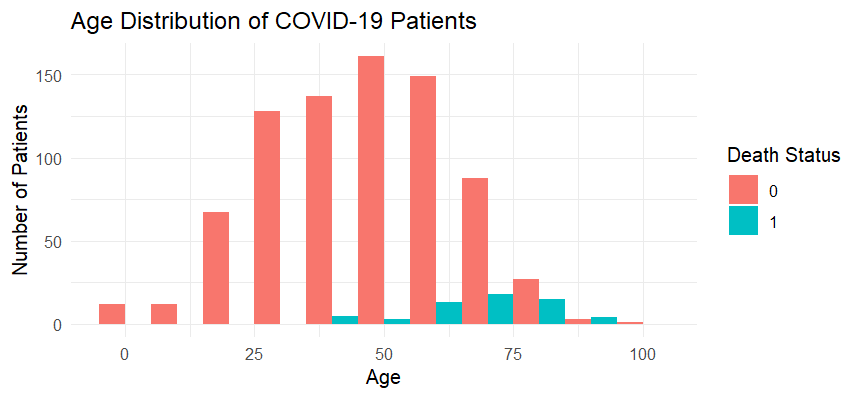
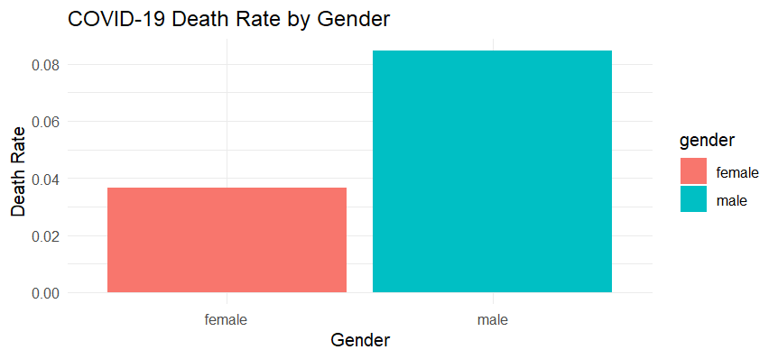
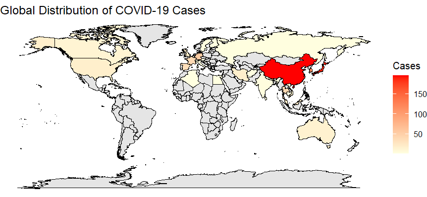
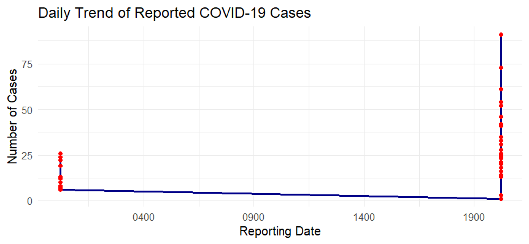

# COVID-19 Data Analysis using R

This project performs exploratory data analysis on COVID-19 patient data using R.  
The goal is to analyze mortality trends, gender differences, age-related risk, and global case distribution.

## Dataset
COVID19_line_list_data.csv containing patient data such as:
- Age
- Gender
- Country
- Death outcome
- Recovery status

## Analysis Performed
- Age vs mortality statistical testing
- Gender mortality comparison
- Logistic regression model
- Country-level case analysis
- Global COVID case visualization

## Technologies Used
- R
- ggplot2
- dplyr
- corrplot
- maps

## Sample Visualizations

### Age Distribution

### Gender Death Rate

### Global COVID Map

### Daily Case Trend

